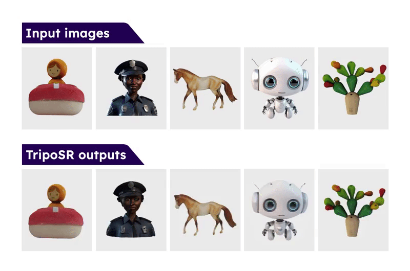
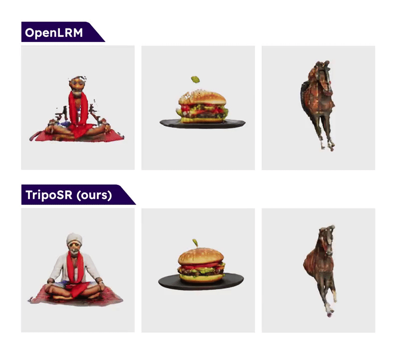
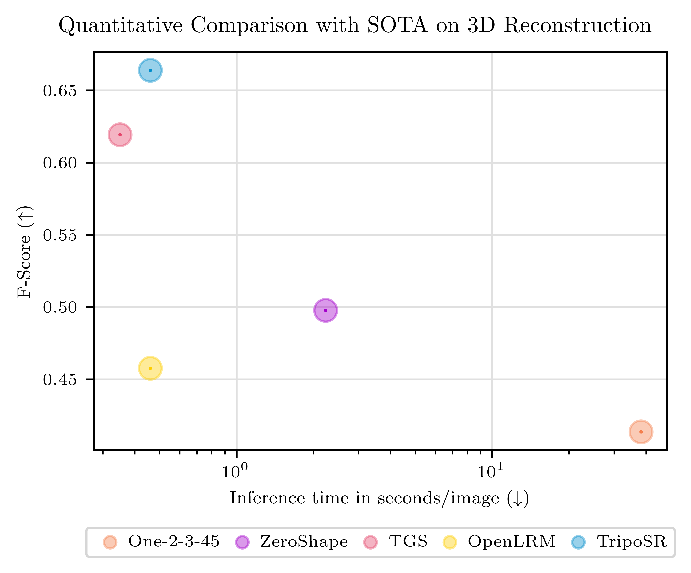

# TripoSR <a href="https://huggingface.co/stabilityai/TripoSR"></a> <a href="https://huggingface.co/spaces/stabilityai/TripoSR"></a> <a href="https://huggingface.co/papers/2403.02151"></a> <a href="https://arxiv.org/abs/2403.02151"></a> <a href="https://discord.gg/mvS9mCfMnQ"></a>

<div align="center">
  
</div>

This is the official codebase for **TripoSR**, a state-of-the-art open-source model for **fast** feedforward 3D reconstruction from a single image, collaboratively developed by [Tripo AI](https://www.tripo3d.ai/) and [Stability AI](https://stability.ai/).
<br><br>
Leveraging the principles of the [Large Reconstruction Model (LRM)](https://yiconghong.me/LRM/), TripoSR brings to the table key advancements that significantly boost both the speed and quality of 3D reconstruction. Our model is distinguished by its ability to rapidly process inputs, generating high-quality 3D models in less than 0.5 seconds on an NVIDIA A100 GPU. TripoSR has exhibited superior performance in both qualitative and quantitative evaluations, outperforming other open-source alternatives across multiple public datasets. The figures below illustrate visual comparisons and metrics showcasing TripoSR's performance relative to other leading models. Details about the model architecture, training process, and comparisons can be found in this [technical report](https://arxiv.org/abs/2403.02151).

<!--
<div align="center">
  
</div>
-->
<p align="center">
    
</p>

<p align="center">
    
</p>


The model is released under the MIT license, which includes the source code, pretrained models, and an interactive online demo. Our goal is to empower researchers, developers, and creatives to push the boundaries of what's possible in 3D generative AI and 3D content creation.

## Getting Started
### Installation
- Use Python 3.10. Newer versions may work, but Python 3.10 is the safest target for the compiled ML/3D dependencies used by this project.
- Install CUDA if available.
- Install PyTorch according to your platform: [https://pytorch.org/get-started/locally/](https://pytorch.org/get-started/locally/) **[Please make sure that the locally-installed CUDA major version matches the PyTorch-shipped CUDA major version. For example if you have CUDA 11.x installed, make sure to install PyTorch compiled with CUDA 11.x.]**

Create and activate a virtual environment:

```sh
python3.10 -m venv .venv
source .venv/bin/activate
```

If `pip` is missing, enable or install it first:

```sh
python -m ensurepip --upgrade
```

On Debian/Ubuntu, if `ensurepip` is unavailable, install the system packages:

```sh
sudo apt update
sudo apt install python3-pip python3-venv python3.10-venv
```

Then install the dependencies:

```sh
python -m pip install --upgrade pip setuptools
python -m pip install -r requirements.txt
```

Use `python -m pip` instead of plain `pip` so the packages install into the active Python environment.

### Manual Inference
```sh
python run.py examples/chair.png --output-dir output/
```
This will save the reconstructed 3D model to `output/`. You can also specify more than one image path separated by spaces. The local defaults are tuned for smaller GPUs: renderer chunk size `2048` and marching-cubes resolution `192`. Use `--mc-resolution 256` for more detail if your GPU has enough free VRAM.

If you would like to output a texture instead of vertex colors, use the `--bake-texture` option. You may also use `--texture-resolution` to specify the resolution in pixels of the output texture.

For detailed usage of this script, use `python run.py --help`.

### Local Gradio App
```sh
python gradio_app.py
```

The Gradio app uses a queue with one generation running at a time. This is recommended for laptops with 8 GB RAM / RTX 3050 Ti-class GPUs, because multiple simultaneous generations can exhaust memory. Incoming requests wait in the queue instead of starting extra model runs.

### Background API
Run the model once and expose it over HTTP for other projects:
```sh
python api.py --host 0.0.0.0 --port 8000 --workers 1 --max-concurrent-jobs 1 --queue-size 8
```

For your laptop spec, keep `--workers 1` and `--max-concurrent-jobs 1`. The API loads one model copy, accepts multiple requests, and runs heavy generation work through a bounded queue. You can check the queue and runtime defaults with:

```sh
curl http://127.0.0.1:8000/health
```

Each Uvicorn worker loads its own copy of the model. Use `--workers` greater than `1` only on machines with enough RAM/VRAM for multiple model copies. On an 8 GB RAM laptop, multiple workers are likely to cause memory pressure.

Useful memory knobs:

```sh
TRIPOSR_RENDERER_CHUNK_SIZE=1024 TRIPOSR_MC_RESOLUTION=160 python api.py --host 0.0.0.0 --port 8000 --workers 1
```

Example request:
```sh
curl -F "image=@examples/chair.png" http://127.0.0.1:8000/generate
```

## Troubleshooting
> AttributeError: module 'torchmcubes_module' has no attribute 'mcubes_cuda'

or

> torchmcubes was not compiled with CUDA support, use CPU version instead.

This is because `torchmcubes` is compiled without CUDA support. Please make sure that 

- The locally-installed CUDA major version matches the PyTorch-shipped CUDA major version. For example if you have CUDA 11.x installed, make sure to install PyTorch compiled with CUDA 11.x.
- `setuptools>=49.6.0`. If not, upgrade by `python -m pip install --upgrade setuptools`.

Then re-install `torchmcubes` by:

```sh
python -m pip uninstall torchmcubes
python -m pip install git+https://github.com/tatsy/torchmcubes.git
```

## Citation
```BibTeX
@article{TripoSR2024,
  title={TripoSR: Fast 3D Object Reconstruction from a Single Image},
  author={Tochilkin, Dmitry and Pankratz, David and Liu, Zexiang and Huang, Zixuan and and Letts, Adam and Li, Yangguang and Liang, Ding and Laforte, Christian and Jampani, Varun and Cao, Yan-Pei},
  journal={arXiv preprint arXiv:2403.02151},
  year={2024}
}
```
